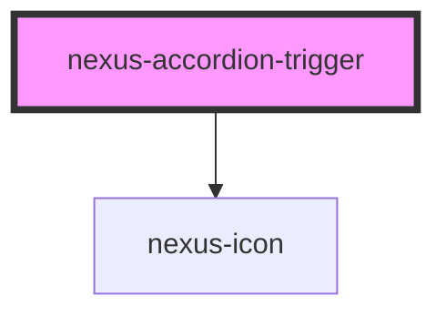

# nexus-accordion-trigger

<!-- Auto Generated Below -->

## Properties

| Property | Attribute | Description           | Type                           | Default   |
| -------- | --------- | --------------------- | ------------------------------ | --------- |
| `align`  | `align`   | Align header content. | `"center" \| "end" \| "start"` | `'start'` |

## Events

| Event           | Description                                                      | Type               |
| --------------- | ---------------------------------------------------------------- | ------------------ |
| `_triggerClick` | Trigger accordion toggle events upon clicking the toggle button. | `CustomEvent<any>` |

## Dependencies

### Depends on

- [nexus-icon](../../nexus-icon)

### Graph

----------------------------------------------

