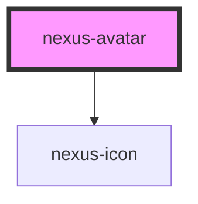

# nexus-avatar

<!-- Auto Generated Below -->

## Properties

| Property             | Attribute             | Description                                                                   | Type      | Default  |
| -------------------- | --------------------- | ----------------------------------------------------------------------------- | --------- | -------- |
| `avatarClassName`    | `avatar-class-name`   | Specify a custom class to override styles of the Avatar component.            | `string`  | `''`     |
| `avatarDark`         | `avatar-dark`         | Avatar dark mode.                                                             | `boolean` | `false`  |
| `avatarImageSrc`     | `avatar-image-src`    | Specifies the path to the image.                                              | `string`  | `''`     |
| `avatarLogoIcon`     | `avatar-logo-icon`    | Avatar logo icon.                                                             | `string`  | `''`     |
| `avatarNameDisplay`  | `avatar-name-display` | Avatar name display.                                                          | `boolean` | `true`   |
| `avatarNotification` | `avatar-notification` | Avatar notification icon.                                                     | `string`  | `''`     |
| `avatarSize`         | `avatar-size`         | Avatar Size.                                                                  | `string`  | `'lg'`   |
| `avatarStatus`       | `avatar-status`       | Avatar connection status.                                                     | `string`  | `''`     |
| `description`        | `description`         | Specifies an alternate text for an image.                                     | `string`  | `''`     |
| `userName`           | `user-name`           | Will be used as a description and formated as initials if no src is provided. | `string`  | `'Name'` |

## Dependencies

### Depends on

- [nexus-icon](../nexus-icon)

### Graph

----------------------------------------------

