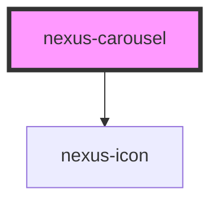

# nexus-carousel

<!-- Auto Generated Below -->

## Properties

| Property  | Attribute | Description           | Type       | Default     |
| --------- | --------- | --------------------- | ---------- | ----------- |
| `options` | --        | Configuration options | `Config[]` | `undefined` |

## Dependencies

### Depends on

- [nexus-icon](../nexus-icon)

### Graph

----------------------------------------------

