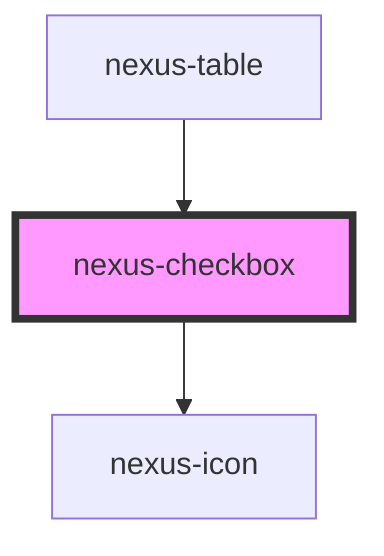

# nexus-checkbox

<!-- Auto Generated Below -->

## Properties

| Property        | Attribute       | Description                                     | Type      | Default    |
| --------------- | --------------- | ----------------------------------------------- | --------- | ---------- |
| `attrId`        | `attr-id`       | The unique identifier of the checkbox.          | `string`  | `'attrId'` |
| `checked`       | `checked`       | Whether the input is checked.                   | `boolean` | `false`    |
| `disabled`      | `disabled`      | Whether the input is disabled.                  | `boolean` | `false`    |
| `indeterminate` | `indeterminate` | Whether the input is in an indeterminate state. | `boolean` | `false`    |
| `required`      | `required`      | Whether the input is required.                  | `boolean` | `false`    |

## Dependencies

### Used by

 - [nexus-table](../nexus-table)

### Depends on

- [nexus-icon](../nexus-icon)

### Graph

----------------------------------------------

