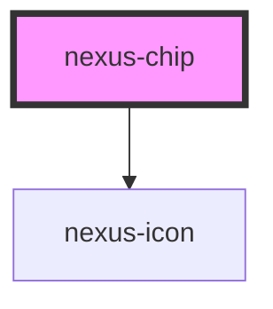

# nexus-chip

<!-- Auto Generated Below -->

## Properties

| Property    | Attribute   | Description                                                                                | Type      | Default |
| ----------- | ----------- | ------------------------------------------------------------------------------------------ | --------- | ------- |
| `disabled`  | `disabled`  | Whether the chip is disabled, making it unusable and unclickable.                          | `boolean` | `false` |
| `error`     | `error`     | Whether the chip is in a error state                                                       | `boolean` | `false` |
| `removable` | `removable` | Whether the chip contains the "X" icon, notifying the user that they can remove that chip. | `boolean` | `false` |
| `success`   | `success`   | Whether a green border is added to the chip, showing success state.                        | `boolean` | `false` |

## Events

| Event                   | Description                         | Type               |
| ----------------------- | ----------------------------------- | ------------------ |
| `triggerRemovableClick` | Trigger removable icon click event. | `CustomEvent<any>` |

## Dependencies

### Depends on

- [nexus-icon](../nexus-icon)

### Graph

----------------------------------------------

