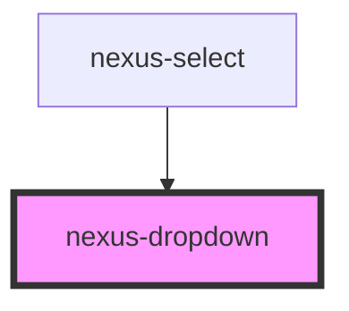

# nexus-dropdown

<!-- Auto Generated Below -->

## Properties

| Property       | Attribute       | Description                    | Type                            | Default     |
| -------------- | --------------- | ------------------------------ | ------------------------------- | ----------- |
| `dropdownType` | `dropdown-type` | Whether the dropdown is basic  | `"basic" \| "select"`           | `'basic'`   |
| `height`       | `height`        | Maximal height of dropdown     | `number`                        | `undefined` |
| `placement`    | `placement`     | Whether the select is native   | `"center" \| "left" \| "right"` | `'left'`    |
| `show`         | `show`          | Show and hide dropdown content | `boolean`                       | `false`     |
| `width`        | `width`         | Maximal width of dropdown      | `number`                        | `undefined` |

## Events

| Event        | Description                                        | Type               |
| ------------ | -------------------------------------------------- | ------------------ |
| `closeEvent` | set the drop down position with respective offset. | `CustomEvent<any>` |

## Methods

### `setDropdownTop(top: any) => Promise<void>`

#### Returns

Type: `Promise<void>`

## Dependencies

### Used by

 - [nexus-select](../nexus-select)

### Graph

----------------------------------------------

