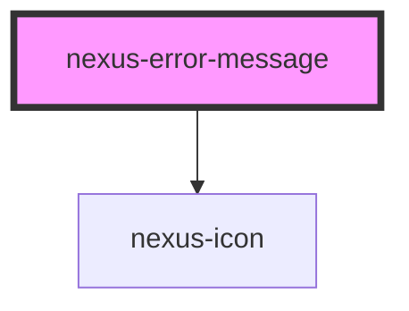

# nexus-error-message

<!-- Auto Generated Below -->

## Dependencies

### Depends on

- [nexus-icon](../nexus-icon)

### Graph

```mermaid
graph TD;
  nexus-error-message --> nexus-icon
  style nexus-error-message fill:#f9f,stroke:#333,stroke-width:4px
```

----------------------------------------------

