# nexus-icon

<!-- Auto Generated Below -->

## Properties

| Property   | Attribute   | Description                                                                                                                                         | Type                                         | Default     |
| ---------- | ----------- | --------------------------------------------------------------------------------------------------------------------------------------------------- | -------------------------------------------- | ----------- |
| `alt`      | `alt`       | Alternative text for accessibility.                                                                                                                 | `string`                                     | `''`        |
| `content`  | `content`   | The precompiled content of the svg.                                                                                                                 | `string`                                     | `undefined` |
| `size`     | `size`      | Adjust the icon size (xs = 12px, sm = 16px, md = 24px, lg = 48px, xl = 64px).                                                                       | `"" \| "lg" \| "md" \| "sm" \| "xl" \| "xs"` | `''`        |
| `sizeLock` | `size-lock` | Making applied size can't changed upon re-layouting of parent container by applying min width and height value as its specified in width and height | `boolean`                                    | `false`     |
| `src`      | `src`       | The path to the svg. Will request the SVG.                                                                                                          | `string`                                     | `undefined` |
| `type`     | `type`      | Enables to load the icons using img markup, Improves performance since it uses browser cache to save image and reduces repeated calls.              | `"img" \| "svg"`                             | `'svg'`     |

## Dependencies

### Used by

 - [nexus-accordion-trigger](../nexus-accordion/nexus-accordion-trigger)
 - [nexus-avatar](../nexus-avatar)
 - [nexus-carousel](../nexus-carousel)
 - [nexus-checkbox](../nexus-checkbox)
 - [nexus-chip](../nexus-chip)
 - [nexus-error-message](../nexus-error-message)
 - [nexus-file-upload](../nexus-file-upload)
 - [nexus-header-menu](../nexus-header/nexus-header-menu)
 - [nexus-menu](../nexus-menu)
 - [nexus-modal-header](../nexus-modal/nexus-modal-header)
 - [nexus-notification](../nexus-notification)
 - [nexus-pagination](../nexus-pagination)
 - [nexus-stepper-item](../nexus-stepper/nexus-stepper-item)
 - [nexus-table](../nexus-table)
 - [nexus-toast](../nexus-toast)
 - [nexus-tooltip-content](../nexus-tooltip/nexus-tooltip-content)
 - [nexus-tree-trigger](../nexus-tree/nexus-tree-trigger)

### Graph

```mermaid
graph TD;
  nexus-accordion-trigger --> nexus-icon
  nexus-avatar --> nexus-icon
  nexus-carousel --> nexus-icon
  nexus-checkbox --> nexus-icon
  nexus-chip --> nexus-icon
  nexus-error-message --> nexus-icon
  nexus-file-upload --> nexus-icon
  nexus-header-menu --> nexus-icon
  nexus-menu --> nexus-icon
  nexus-modal-header --> nexus-icon
  nexus-notification --> nexus-icon
  nexus-pagination --> nexus-icon
  nexus-stepper-item --> nexus-icon
  nexus-table --> nexus-icon
  nexus-toast --> nexus-icon
  nexus-tooltip-content --> nexus-icon
  nexus-tree-trigger --> nexus-icon
  style nexus-icon fill:#f9f,stroke:#333,stroke-width:4px
```

----------------------------------------------

