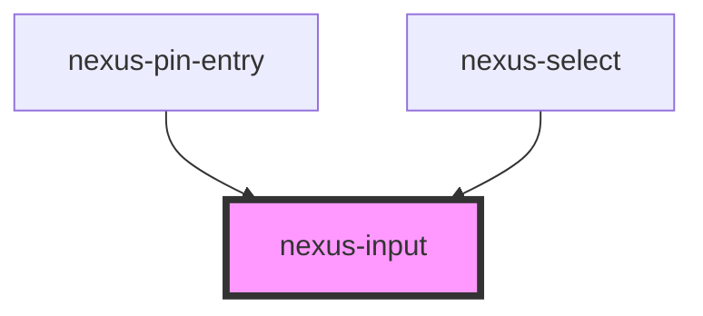

# nexus-input

<!-- Auto Generated Below -->

## Properties

| Property       | Attribute      | Description                                                                                                   | Type                                                             | Default     |
| -------------- | -------------- | ------------------------------------------------------------------------------------------------------------- | ---------------------------------------------------------------- | ----------- |
| `attrId`       | `attr-id`      | The Unique identifier for the input and the label to match. If none is provided one will be added by default. | `string`                                                         | `''`        |
| `autocomplete` | `autocomplete` | Disables autocomplete                                                                                         | `"off"`                                                          | `undefined` |
| `disabled`     | `disabled`     | Whether the form control is disabled                                                                          | `boolean`                                                        | `undefined` |
| `max`          | `max`          | Specify the Maximum value of the input field                                                                  | `string`                                                         | `undefined` |
| `maxLength`    | `max-length`   | Maximum length (number of characters) of value                                                                | `number`                                                         | `undefined` |
| `min`          | `min`          | Specify the Minimum value of the input field                                                                  | `string`                                                         | `undefined` |
| `minLength`    | `min-length`   | Minimum length (number of characters) of value                                                                | `number`                                                         | `undefined` |
| `placeholder`  | `placeholder`  | Minimum length (number of characters) of value                                                                | `string`                                                         | `undefined` |
| `readonly`     | `readonly`     | The readonly of the input                                                                                     | `boolean`                                                        | `undefined` |
| `required`     | `required`     | Whether the form control is required                                                                          | `boolean`                                                        | `undefined` |
| `type`         | `type`         | The type of input element                                                                                     | `"date" \| "email" \| "number" \| "password" \| "tel" \| "text"` | `'text'`    |
| `value`        | `value`        | The value of the input                                                                                        | `string`                                                         | `''`        |

## Events

| Event             | Description                                        | Type               |
| ----------------- | -------------------------------------------------- | ------------------ |
| `_disabledChange` | Internal event for updating disabled form elements | `CustomEvent<any>` |

## Dependencies

### Used by

 - [nexus-pin-entry](../nexus-pin-entry)
 - [nexus-select](../nexus-select)

### Graph

----------------------------------------------

