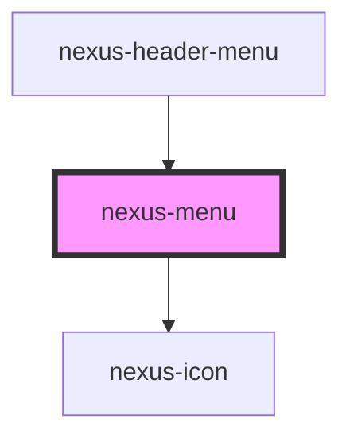

# nexus-menu

<!-- Auto Generated Below -->

## Properties

| Property   | Attribute  | Description                                | Type                | Default   |
| ---------- | ---------- | ------------------------------------------ | ------------------- | --------- |
| `open`     | `open`     | Whether the menu is open                   | `boolean`           | `false`   |
| `position` | `position` | Side of the viewport to open the menu from | `"left" \| "right"` | `'right'` |

## Events

| Event        | Description                         | Type               |
| ------------ | ----------------------------------- | ------------------ |
| `closeEvent` | Event fired when the menu is closed | `CustomEvent<any>` |

## Dependencies

### Used by

 - [nexus-header-menu](../nexus-header/nexus-header-menu)

### Depends on

- [nexus-icon](../nexus-icon)

### Graph

----------------------------------------------

