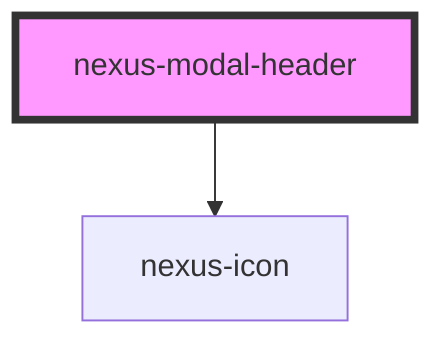

# nexus-modal-header

<!-- Auto Generated Below -->

## Events

| Event        | Description                                        | Type               |
| ------------ | -------------------------------------------------- | ------------------ |
| `closeEvent` | Event fired when the close icon button is clicked. | `CustomEvent<any>` |

## Dependencies

### Depends on

- [nexus-icon](../../nexus-icon)

### Graph

----------------------------------------------

