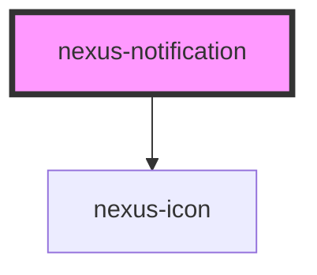

# nexus-notification

<!-- Auto Generated Below -->

## Properties

| Property  | Attribute | Description              | Type                                          | Default  |
| --------- | --------- | ------------------------ | --------------------------------------------- | -------- |
| `variant` | `variant` | The type of notification | `"error" \| "info" \| "success" \| "warning"` | `'info'` |

## Dependencies

### Depends on

- [nexus-icon](../nexus-icon)

### Graph

----------------------------------------------

