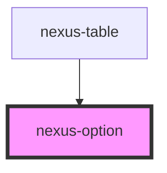

# nexus-option

<!-- Auto Generated Below -->

## Properties

| Property   | Attribute  | Description                            | Type                          | Default     |
| ---------- | ---------- | -------------------------------------- | ----------------------------- | ----------- |
| `disabled` | `disabled` | Is the option disabled                 | `boolean`                     | `undefined` |
| `keyhover` | `keyhover` | Add hover effect if keydown is pressed | `boolean`                     | `undefined` |
| `label`    | `label`    |  Label for the option.                 | `boolean \| number \| string` | `undefined` |
| `multiple` | `multiple` |  Multipe option selection.             | `boolean`                     | `undefined` |
| `selected` | `selected` | Is the option selected                 | `boolean`                     | `undefined` |
| `value`    | `value`    |  Value for the option selected.        | `boolean \| number \| string` | `undefined` |

## Events

| Event                   | Description                             | Type               |
| ----------------------- | --------------------------------------- | ------------------ |
| `triggerOptionSelected` | Event fired when the option is clicked. | `CustomEvent<any>` |

## Methods

### `setPropsValue(value: any) => Promise<void>`

set the Prop values for option

#### Returns

Type: `Promise<void>`

## Dependencies

### Used by

 - [nexus-table](../nexus-table)

### Graph

----------------------------------------------

