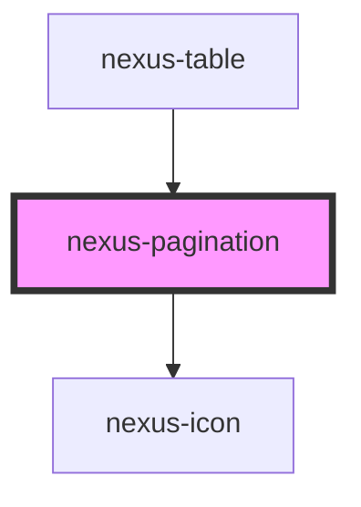

# nexus-pagination

<!-- Auto Generated Below -->

## Properties

| Property  | Attribute | Description         | Type     | Default     |
| --------- | --------- | ------------------- | -------- | ----------- |
| `current` | `current` | Current Page        | `number` | `1`         |
| `max`     | `max`     | Max number of pages | `number` | `undefined` |

## Events

| Event         | Description                       | Type               |
| ------------- | --------------------------------- | ------------------ |
| `changeEvent` | Event fired when page is changed. | `CustomEvent<any>` |

## Dependencies

### Used by

 - [nexus-table](../nexus-table)

### Depends on

- [nexus-icon](../nexus-icon)

### Graph

----------------------------------------------

