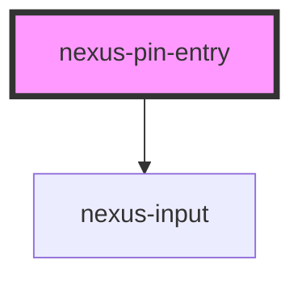

# nexus-pin-entry

<!-- Auto Generated Below -->

## Properties

| Property   | Attribute  | Description                             | Type                            | Default  |
| ---------- | ---------- | --------------------------------------- | ------------------------------- | -------- |
| `disabled` | `disabled` | Whether the pin is disabled             | `boolean`                       | `false`  |
| `length`   | `length`   | Length of pin entry                     | `number`                        | `1`      |
| `type`     | `type`     | Type for pin entry, e.g. text, password | `"password" \| "tel" \| "text"` | `'text'` |

## Events

| Event      | Description                      | Type               |
| ---------- | -------------------------------- | ------------------ |
| `pinEvent` | Event fired when pin is entered. | `CustomEvent<any>` |

## Dependencies

### Depends on

- [nexus-input](../nexus-input)

### Graph

----------------------------------------------

