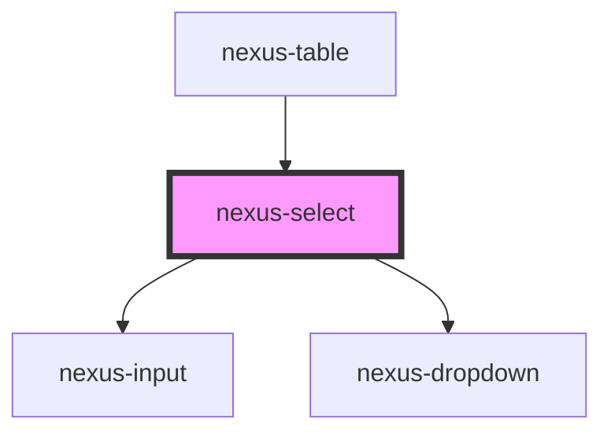

# nexus-select

<!-- Auto Generated Below -->

## Properties

| Property      | Attribute     | Description                                                                                                    | Type                   | Default     |
| ------------- | ------------- | -------------------------------------------------------------------------------------------------------------- | ---------------------- | ----------- |
| `attrId`      | `attr-id`     | The Unique identifier for the select and the label to match. If none is provided one will be added by default. | `string`               | `undefined` |
| `delimiter`   | `delimiter`   | The default selected option.                                                                                   | `string`               | `undefined` |
| `disabled`    | `disabled`    | Whether the select is disabled.                                                                                | `boolean`              | `undefined` |
| `multiple`    | `multiple`    | Multipe option selection.                                                                                      | `boolean`              | `false`     |
| `placeholder` | `placeholder` | Short hint that describes the expected value of an input                                                       | `string`               | `undefined` |
| `required`    | `required`    | Whether the select is required.                                                                                | `boolean`              | `undefined` |
| `type`        | `type`        | Whether the select is native                                                                                   | `"custom" \| "native"` | `'native'`  |
| `value`       | `value`       | The default selected option.                                                                                   | `string`               | `undefined` |

## Events

| Event              | Description                                        | Type               |
| ------------------ | -------------------------------------------------- | ------------------ |
| `_disabledChange`  | Internal event for updating disabled form elements | `CustomEvent<any>` |
| `closeEvent`       | Event emited when clicked outside of select        | `CustomEvent<any>` |
| `triggerSelection` | Event for updating selected option                 | `CustomEvent<any>` |

## Dependencies

### Used by

 - [nexus-table](../nexus-table)

### Depends on

- [nexus-input](../nexus-input)
- [nexus-dropdown](../nexus-dropdown)

### Graph

----------------------------------------------

