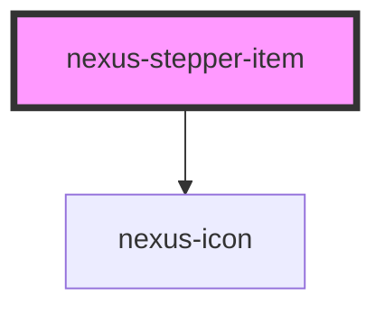

# nexus-stepper-item

<!-- Auto Generated Below -->

## Properties

| Property | Attribute | Description                | Type                                                                       | Default     |
| -------- | --------- | -------------------------- | -------------------------------------------------------------------------- | ----------- |
| `status` | `status`  | current status of the step | `"active" \| "complete" \| "default" \| "error" \| "skipped" \| "warning"` | `'default'` |

## Methods

### `setPropsValue(value: any, index: any) => Promise<void>`

#### Returns

Type: `Promise<void>`

## Dependencies

### Depends on

- [nexus-icon](../../nexus-icon)

### Graph

----------------------------------------------

