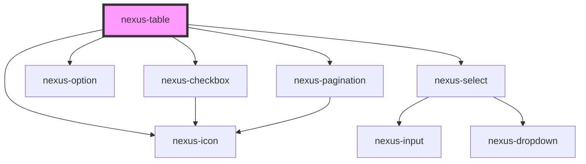

# nexus-table

<!-- Auto Generated Below -->

## Properties

| Property               | Attribute                 | Description                           | Type                  | Default                                                  |
| ---------------------- | ------------------------- | ------------------------------------- | --------------------- | -------------------------------------------------------- |
| `attrId`               | `attr-id`                 | Nexus table id                        | `string`              | `undefined`                                              |
| `columns`              | `columns`                 | Table Header Data                     | `any`                 | `[]`                                                     |
| `currentPage`          | `current-page`            | Current Page                          | `number`              | `null`                                                   |
| `enablePageSizeOption` | `enable-page-size-option` | Page size options dropdown visibility | `boolean`             | `true`                                                   |
| `maxHeight`            | `max-height`              | Pass height of the table(in px)       | `string`              | `''`                                                     |
| `pageSize`             | `page-size`               | Default page size.                    | `number`              | `10`                                                     |
| `pageSizeLabel`        | `page-size-label`         | Table footer page size lable.         | `string`              | `null`                                                   |
| `pageSizeOpt`          | --                        | Page size options dropdown.           | `number[]`            | `[5, 10, 25, 100]`                                       |
| `pagination`           | `pagination`              | Show/Hide table row pagination.       | `boolean`             | `false`                                                  |
| `rowSelection`         | `row-selection`           | Table row selection.                  | `boolean`             | `false`                                                  |
| `rows`                 | --                        | Row data for table content.           | `any[]`               | `[]`                                                     |
| `sortAscIcon`          | `sort-asc-icon`           | Column Sort Icon - Ascending order.   | `string`              | `'./assets/icons/navigation/ic_arrow_upward_24px.svg'`   |
| `sortDefaultIcon`      | `sort-default-icon`       | Column Sort Icon - Neutral state.     | `string`              | `'./assets/icons/content/ic_sort_24px.svg'`              |
| `sortDescIcon`         | `sort-desc-icon`          | Column Sort Icon - Descending order.  | `string`              | `'./assets/icons/navigation/ic_arrow_downward_24px.svg'` |
| `totalItems`           | `total-items`             | Pass height of the table(in px)       | `number`              | `undefined`                                              |
| `type`                 | `type`                    | Table Type selection                  | `"basic" \| "custom"` | `'basic'`                                                |

## Events

| Event              | Description                                    | Type                 |
| ------------------ | ---------------------------------------------- | -------------------- |
| `rowSelect`        | Emit list of selected rows                     | `CustomEvent<any[]>` |
| `tableChangeEvent` | Emit current page details on table data change | `CustomEvent<any>`   |

## Dependencies

### Depends on

- [nexus-icon](../nexus-icon)
- [nexus-select](../nexus-select)
- [nexus-option](../nexus-option)
- [nexus-checkbox](../nexus-checkbox)
- [nexus-pagination](../nexus-pagination)

### Graph

----------------------------------------------

