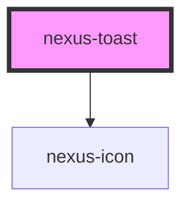

# nexus-toast

<!-- Auto Generated Below -->

## Properties

| Property    | Attribute    | Description                                            | Type                                                      | Default     |
| ----------- | ------------ | ------------------------------------------------------ | --------------------------------------------------------- | ----------- |
| `autoClose` | `auto-close` | Trigger automatic close of toast after n milli-seconds | `number`                                                  | `undefined` |
| `closeable` | `closeable`  | Whether the toast can be closed.                       | `boolean`                                                 | `false`     |
| `iconSrc`   | `icon-src`   | custom icon for toast                                  | `string`                                                  | `''`        |
| `position`  | `position`   | The position of the toast                              | `"bottom" \| "top"`                                       | `undefined` |
| `show`      | `show`       | Hide toasts when set to false.                         | `boolean`                                                 | `true`      |
| `variant`   | `variant`    | The style of the toast.                                | `"custom" \| "error" \| "info" \| "success" \| "warning"` | `'info'`    |

## Events

| Event        | Description                                           | Type               |
| ------------ | ----------------------------------------------------- | ------------------ |
| `closeEvent` | Event fired when the tooltip close button is clicked. | `CustomEvent<any>` |

## Dependencies

### Depends on

- [nexus-icon](../nexus-icon)

### Graph

----------------------------------------------

