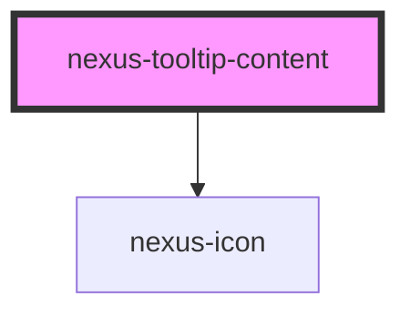

# nexus-tooltip-content

<!-- Auto Generated Below -->

## Events

| Event           | Description                                | Type               |
| --------------- | ------------------------------------------ | ------------------ |
| `_closeTooltip` | Internal event for closing tooltip content | `CustomEvent<any>` |

## Methods

### `_show(positions: any, id: any) => Promise<void>`

Internal method for showing tooltip content

#### Returns

Type: `Promise<void>`

## Dependencies

### Depends on

- [nexus-icon](../../nexus-icon)

### Graph

----------------------------------------------

