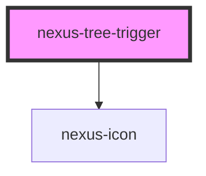

# nexus-tree-trigger

<!-- Auto Generated Below -->

## Events

| Event         | Description                                  | Type               |
| ------------- | -------------------------------------------- | ------------------ |
| `_toggleTree` | Private event fired when the tree is toggled | `CustomEvent<any>` |

## Dependencies

### Depends on

- [nexus-icon](../../nexus-icon)

### Graph

----------------------------------------------

